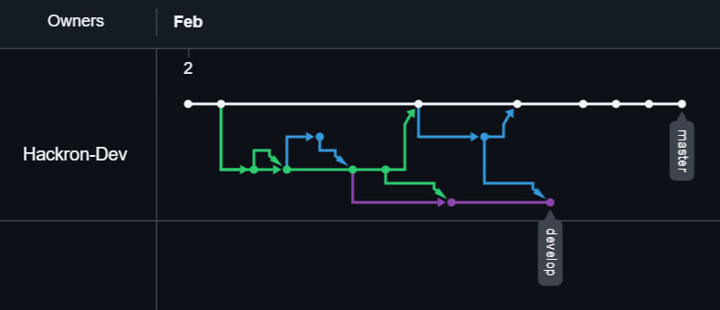

# GitFlow Demo Project

## About
A demonstration project for implementing GitFlow branching strategy.

## Developer
 [Hackron]

## Documentation
- [Installation Guide](INSTALL.md)
- [Changelog](CHANGELOG.md)

## Version
1.0.1

# Project Documentation

- [Home Wiki](https://github.com/Hackron-Dev/gitflow-demo/wiki)

## Logo

  

## Network

  

